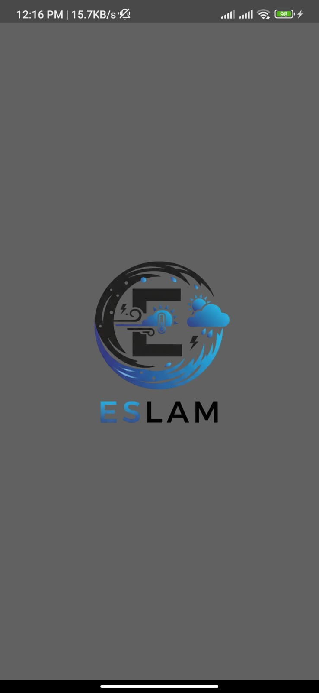
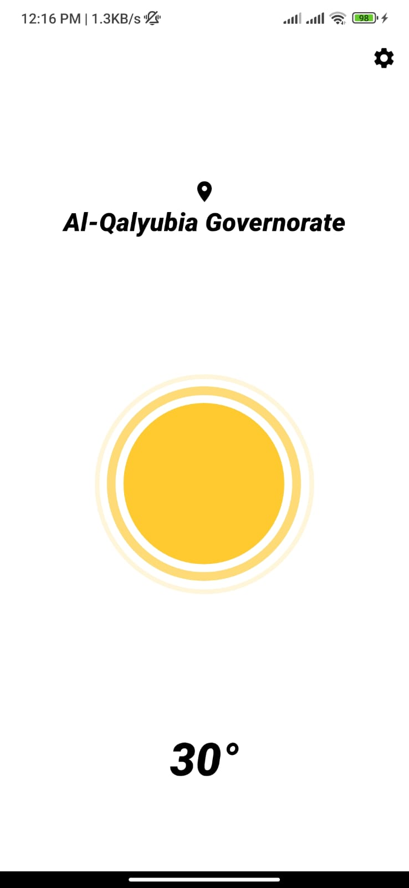
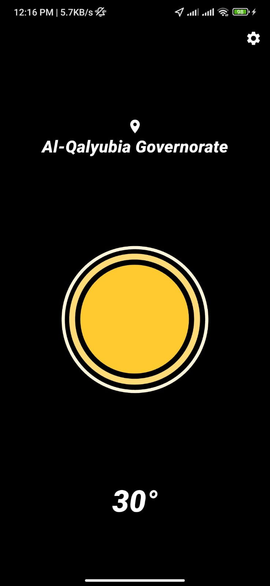
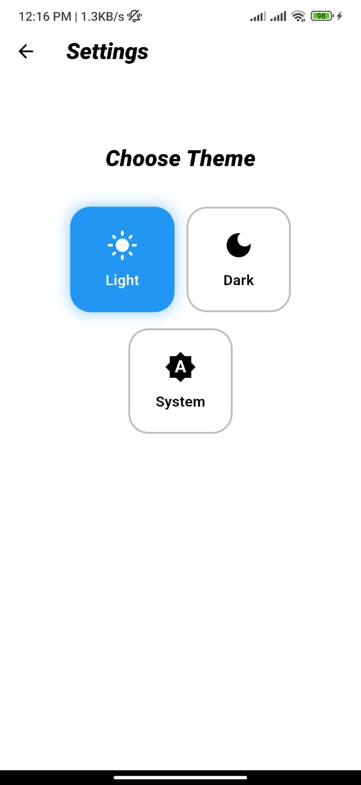

# Minimal Weather App

A clean, minimal weather application built with Flutter. It automatically detects your location to display the current temperature and weather conditions, complete with beautiful Lottie animations and persistent theme support (Light/Dark/System).

## Features

* ☀️ **Dynamic Weather:** Displays the current temperature and weather condition.
* 📍 **Location-Based:** Automatically fetches weather data for your current location using the `geolocator` and `WeatherService`.
* 🏙️ **City Name Display:** Uses `geocoding` to convert latitude/longitude into a user-friendly city name.
* 🎨 **Theme Support:** Includes beautifully crafted Light and Dark themes.
* ⚙️ **System Theme:** Automatically adapts to the user's system theme preference.
* 💾 **Persistent Theme:** Saves the user's theme choice (Light, Dark, or System) locally using `shared_preferences`.
* 📱 **Responsive UI:** Adapts to different screen sizes using `flutter_screenutil`.
* ✨ **Animations:**
    * An animated splash screen with fade and scale transitions.
    * Dynamic Lottie animations that change based on the weather condition (sunny, rainy, cloudy, etc.).

## Screenshots

|                Splash Screen                 |                    Weather (Light)                    |                   Weather (Dark)                    |                 Settings                  |
|:--------------------------------------------:|:-----------------------------------------------------:|:---------------------------------------------------:|:-----------------------------------------:|
|  |  |  |  |
## How It Works

1.  **`main.dart`**: Initializes the app, loads the saved theme using `ThemeProvider`, and sets up `ScreenUtilInit` for responsiveness. `ChangeNotifierProvider` is used to manage the app's theme state.
2.  **`SplashScreen.dart`**: A stateful widget that displays an animated logo for 6 seconds before navigating to the main `WeatherPage`.
3.  **`WeatherPage.dart`**:
    * Fetches the user's current GPS coordinates.
    * Calls `WeatherService` to get weather data from an API (using the provided `apiKey`).
    * Uses `geocoding` to find a displayable city name from the coordinates.
    * Displays the city name, temperature, and a `Lottie` animation relevant to the `mainCondition` (e.g., 'Clouds', 'Rain', 'Clear').
    * Includes an `AppBar` icon to navigate to the `SettingsPage`.
4.  **`SettingsPage.dart`**:
    * Allows the user to select a theme: Light, Dark, or System.
    * Uses `Provider.of<ThemeProvider>(context)` to listen for and update the theme.
    * The UI consists of animated, tappable containers for each theme option.
5.  **`ThemeProvider.dart`**:
    * A `ChangeNotifier` class that manages the `ThemeOption` (light, dark, system).
    * Uses `SharedPreferences` to `saveTheme()` and `loadTheme()` so the user's choice is remembered after the app closes.
6.  **`theme.dart`**: Defines the `ThemeData` for `lightMode` and `darkMode`.

## Key Packages Used

* **State Management:** `provider`
* **UI Responsiveness:** `flutter_screenutil`
* **Animations:** `lottie`
* **Location:** `geolocator` & `geocoding`
* **Local Storage:** `shared_preferences`
* **API Calls:** `http` (implied, for `WeatherService`)

## Setup and Installation

1.  **Clone the repository:**
    ```bash
    git clone [https://github.com/Eslam-code-gif/minimal_weather_app.git](https://github.com/Eslam-code-gif/minimal_weather_app.git)
    cd minimal_weather_app
    ```

2.  **Get dependencies:**
    ```bash
    flutter pub get
    ```

3.  **Add Your API Key:**
    This project requires a weather API key (e.g., from [OpenWeatherMap](https://openweathermap.org/api)).
    You must add your key to the `AppStrings` file (likely in `lib/const/strings.dart`).

    ```dart
    // lib/const/strings.dart
    class AppStrings {
      static const String apiKey = "YOUR_API_KEY_HERE";
      // ... other strings
    }
    ```

4.  **Configure Location Permissions:**
    Ensure you have added the necessary location permissions to your `AndroidManifest.xml` (for Android) and `Info.plist` (for iOS).

5.  **Run the app:**
    ```bash
    flutter run
    ```

## License

Copyright (c) 2025 Abdelrahim mohamed abdelrahim ibrahim

This project is licensed under the [Creative Commons Attribution-NonCommercial 4.0 International License (CC BY-NC 4.0)](https://creativecommons.org/licenses/by-nc/4.0/).

You are free to:

* **Share** — copy and redistribute the material in any medium or format.
* **Adapt** — remix, transform, and build upon the material.

Under the following terms:

* **Attribution** — You must give appropriate credit, provide a link to the license, and indicate if changes were made. You may do so in any reasonable manner, but not in any way that suggests the licensor endorses you or your use.
* **NonCommercial** — You may not use the material for commercial purposes.
* **No additional restrictions** — You may not apply legal terms or technological measures that legally restrict others from doing anything the license permits.
